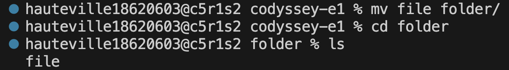

# 01 터미널 기본명령어 
### 1-1. 파일의 현재 위치
`pwd`: 현재 내가 작업 중인 폴더(디렉토리)의 전체 경로를 보는 명령어
```bash
% pwd
/Users/hauteville18620603/Desktop/codyssey-e1
```
### 1-2. 파일 생성
`touch`: 파일의 접근 시간과 수정 시간을 현재 시각으로 갱신하거나, (파일이 존재하지 않을 경우) 파일을 새로 생성하는 명령어

`ls`: 현재 디렉토리에 포함된 파일 및 하위 디렉토리의 목록을 출력하는 명령어

`ls -al`: 숨김 파일(.으로 시작하는 파일)을 포함한 모든 항목을 `-a` 권한·소유자·크기·수정 시각 등의 상세 정보와 함께 `-l` 출력하는 명령어
```bash
% touch file
% ls -al file
-rw-r--r--  1 hauteville18620603  hauteville18620603  0  8  8 13:26 file
```

### 1-3. 폴더 생성
`mkdir`: 새로운 디렉토리(폴더)를 생성하는 명령어

`ls -ald`: 디렉토리 자체의 정보만 `-d` 상세 정보와 함께 `-l` 출력하는 명령어
```bash
% mkdir folder
% ls -ald folder
drwxr-xr-x  2 hauteville18620603  hauteville18620603  64  8  8 13:26 folder
```

### 1-4. 디렉토리 이동
`cd 경로`: 현재 작업 중인 디렉토리를 지정한 경로로 이동(변경)하는 명령어
```bash
yuhyun_lim@DESKTOP-1KO5JJM:/mnt/c/Users/Yuhyun Lim/codyssey-e1$ cd folder
yuhyun_lim@DESKTOP-1KO5JJM:/mnt/c/Users/Yuhyun Lim/codyssey-e1/folder$ 
```
`cd ..`: 한 단계 상위 디렉토리로 이동하는 명령어
```bash
yuhyun_lim@DESKTOP-1KO5JJM:/mnt/c/Users/Yuhyun Lim/codyssey-e1/folder$ cd ..
yuhyun_lim@DESKTOP-1KO5JJM:/mnt/c/Users/Yuhyun Lim/codyssey-e1$
```

### 1-5. 파일 & 폴더 이동 / 이름 변경
`mv`: 파일이나 폴더를 다른 위치로 이동시키거나, 같은 위치에서 이름을 변경하는 명령어


### 1-6. 파일 & 폴더 복사
`cp`: 파일을 복사하는 명령어

`cp -r`: 폴더(디렉토리)를 하위 내용까지 재귀적으로 `-r` 복사하는 명령어

> `cp`는 목적지 경로가 이미 존재하는지, 존재한다면 파일인지 디렉토리인지에 따라 결과가 달라짐. 아래처럼 경우를 나눠서 확인함.

**1) 파일 → 존재하지 않는 이름으로 복사**: 지정한 이름의 새 파일이 생성됨(사실상 "복사 후 이름 변경")
```bash
$ cp file file_copy
$ ls -al file file_copy
-rw-r--r-- 1 Yuhyun Lim 197121 0 Aug  9 22:12 file
-rw-r--r-- 1 Yuhyun Lim 197121 0 Aug  9 22:12 file_copy
```

**2) 파일 → 이미 존재하는 디렉토리로 복사**: 목적지 경로 끝을 디렉토리로 지정하면, 그 디렉토리 안에 원본과 같은 이름으로 복사됨
```bash
$ cp file folder
$ ls -al folder
-rw-r--r-- 1 Yuhyun Lim 197121 0 Aug  9 22:12 file
```
> `cp file folder/file_copy`처럼 목적지에 새 이름까지 지정하면 디렉토리 안에서 이름도 바꿔 복사할 수 있음

**3) 폴더 → 존재하지 않는 이름으로 복사 (`-r` 필요)**: 원본 폴더가 그대로 새 이름으로 복사됨 (내용물이 목적지 폴더 바로 아래에 위치)
```bash
$ cp -r folder folder_copy
$ ls -ald folder folder_copy
drwxr-xr-x 1 Yuhyun Lim 197121 0 Aug  9 22:12 folder
drwxr-xr-x 1 Yuhyun Lim 197121 0 Aug  9 22:12 folder_copy
```

**4) 폴더 → 이미 존재하는 디렉토리로 복사 (`-r` 필요)**: 원본 폴더 이름 그대로 목적지 디렉토리의 하위 폴더로 복사됨 (한 단계 더 들어감에 주의). 3번 실행 직후라 `folder_copy`가 이미 디렉토리로 존재하는 상태에서 같은 명령을 한 번 더 실행하면 이 경우가 됨
```bash
$ cp -r folder folder_copy
$ ls -ald folder_copy/folder
drwxr-xr-x 1 Yuhyun Lim 197121 0 Aug  9 22:12 folder_copy/folder
```

**5) 폴더를 `-r` 없이 복사 시도**: 디렉토리는 그냥 복사되지 않고 에러가 발생함
```bash
$ cp folder folder_copy2
cp: -r not specified; omitting directory 'folder'
```

### 1-7. 파일 & 폴더 삭제
`rm`: 파일을 삭제하는 명령어
```bash
% rm file
% ls -al
total 0
drwxr-xr-x  2 hauteville18620603  hauteville18620603   64  8  2 16:14 .
drwxr-xr-x  5 hauteville18620603  hauteville18620603  160  8  2 16:11 ..
```

`rm -r`: 폴더(디렉토리)와 그 안의 내용을 모두 삭제하는 명령어
```bash
% rm -r folder
% ls -al
total 8
drwxr-xr-x   4 hauteville18620603  hauteville18620603  128  8  2 16:18 .
drwx------+  8 hauteville18620603  hauteville18620603  256  8  2 16:02 ..
drwxr-xr-x  12 hauteville18620603  hauteville18620603  384  8  2 16:02 .git
-rw-r--r--   1 hauteville18620603  hauteville18620603  640  8  2 16:02 README.md
```

### 1-8. 파일 내용 확인
`cat 파일명`: 파일의 내용을 화면에 그대로 출력하는 명령어
```bash
(여기에 cat 실행 결과를 붙여넣어 주세요)
```

