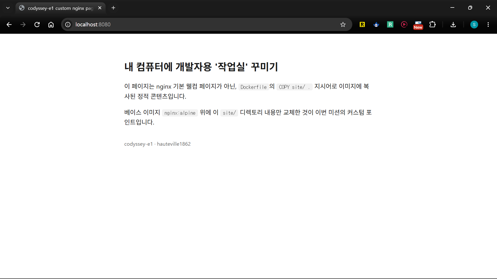

# 07 포트 매핑 및 브라우저 접속 증거

## 명령어 요약

| 명령어 | 설명 |
| --- | --- |
| `docker run -d -p 호스트포트:컨테이너포트 --name 이름 이미지` | 컨테이너 실행과 동시에 포트 매핑 (06번에서 이미 수행) |
| `curl http://localhost:호스트포트` | 터미널에서 응답을 텍스트로 확인 (브라우저 스크린샷의 보조/대안) |

> 이미지 빌드·컨테이너 실행 자체는 [06 이미지 빌드](06-image-build.md)에서 다룸. 이 문서(07)는 그 컨테이너에 실제로 접속해서 포트 매핑이 동작함을 증명하는 데 집중함

### 7-1. 브라우저 접속 증거
06번에서 `-p 8080:80`으로 실행한 `codyssey-e1-web-container`에 브라우저로 접속한 화면.
- 미션 요구사항: 주소창(포트 포함)과 응답 화면이 함께 보여야 함
- 캡처 파일은 `img/`에 저장 후 아래처럼 링크



### 7-2. curl 응답으로 보조 확인 (선택)
```bash
(여기에 curl http://localhost:8080 실행 결과를 붙여넣어 주세요)
```

### 7-3. 재현성 확인 — 다른 호스트 포트로 한 번 더 매핑 (선택)
같은 이미지를 호스트 포트만 바꿔서 다시 실행해도 동일하게 접속되는지 확인 (미션 결과 예시와 동일한 방식)
```bash
(여기에 예: docker run -d -p 8081:80 --name codyssey-e1-web-container-2 codyssey-e1-web 실행 결과를 붙여넣어 주세요)
```
```bash
(여기에 두 번째 포트로의 curl/브라우저 접속 결과를 붙여넣어 주세요)
```

### 7-4. 컨테이너 내부 포트로 직접 접속할 수 없는 이유
(평가기준 항목3 대비: 컨테이너가 호스트와 분리된 네트워크 네임스페이스를 갖기 때문에, `EXPOSE`로 문서화된 포트라도 `-p`로 명시적으로 매핑하지 않으면 호스트에서 접근할 수 없음을 본인 언어로 정리)

(여기에 직접 설명을 작성해 주세요)
