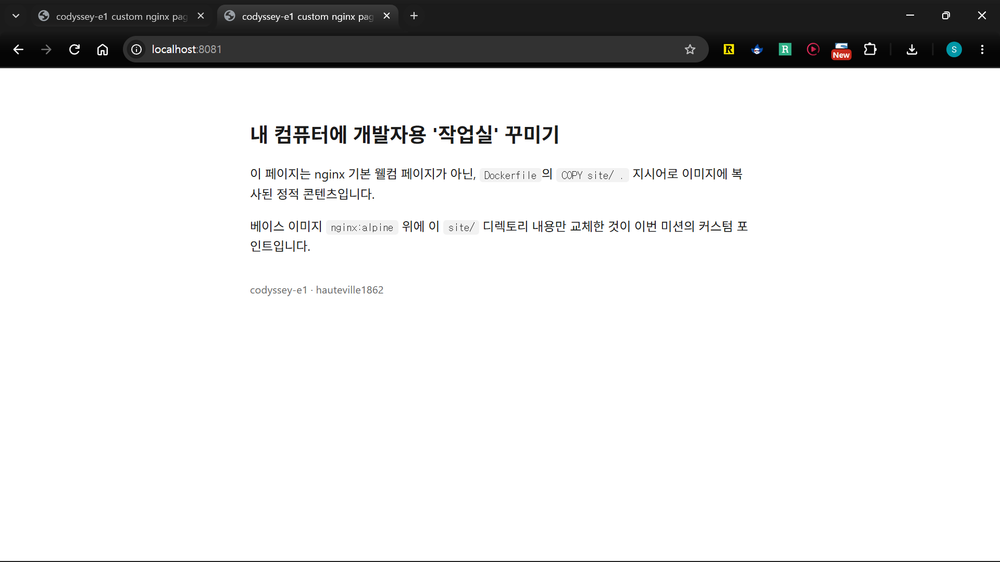

# 07 포트 매핑 및 브라우저 접속 증거

## 명령어 요약

| 명령어 | 설명 |
| --- | --- |
| `docker run -d -p 호스트포트:컨테이너포트 --name 이름 이미지` | 컨테이너 실행과 동시에 포트 매핑 (06번에서 이미 수행) |
| `curl http://localhost:호스트포트` | 터미널에서 응답을 텍스트로 확인 (브라우저 스크린샷의 보조/대안) |

> 이미지 빌드·컨테이너 실행 자체는 [06 이미지 빌드](06-image-build.md)에서 다룸. 이 문서(07)는 그 컨테이너에 실제로 접속해서 포트 매핑이 동작함을 증명하는 데 집중함

### 7-1. 브라우저 접속 증거
06번에서 `-p 8080:80`으로 실행한 `codyssey-e1-web-container`에 브라우저로 접속한 화면.
- 미션 요구사항: 주소창(포트 포함)과 응답 화면이 함께 보여야 함
- 캡처 파일은 `img/`에 저장 후 아래처럼 링크
- 주소창의 `localhost:8080`이 핵심: `localhost`(=내 컴퓨터 자신)의 8080번 포트로 접속했는데, 실제로는 컨테이너 안의 nginx(80번 포트)가 응답한 것 → `-p 8080:80` 매핑이 실제로 동작하고 있다는 증거


### 7-2. curl 응답으로 보조 확인
- `curl 주소`: 브라우저 없이 터미널에서 곧바로 웹 요청을 보내고 응답(이 경우 HTML 원문)을 그대로 출력해주는 명령어
- 브라우저 접속(7-1)과 다른 방식(GUI가 아닌 CLI)으로 같은 결과를 한 번 더 확인하는 것이므로, "우연히 브라우저 캐시에 있던 걸 본 게 아니라 실제로 서버가 응답하고 있다"는 걸 이중으로 증명하는 역할
- 아래 출력에 `app/site/index.html`과 동일한 HTML이 그대로 찍혀 있으면 성공
```bash
$ curl http://localhost:8080
<!DOCTYPE html>
<html lang="ko">
<head>
<meta charset="UTF-8">
<title>codyssey-e1 custom nginx page</title>
<style>
  body {
    font-family: -apple-system, "Segoe UI", sans-serif;
    max-width: 640px;
    margin: 4rem auto;
    padding: 0 1.5rem;
    line-height: 1.6;
    color: #1a1a1a;
  }
  h1 { font-size: 1.6rem; }
  code {
    background: #f2f2f2;
    padding: 0.15rem 0.4rem;
    border-radius: 4px;
  }
  footer {
    margin-top: 2rem;
    font-size: 0.85rem;
    color: #666;
  }
</style>
</head>
<body>
  <h1>내 컴퓨터에 개발자용 '작업실' 꾸미기</h1>
  <p>이 페이지는 nginx 기본 웰컴 페이지가 아닌, <code>Dockerfile</code>의 <code>COPY site/ .</code> 지시어로 이미지에 복사된 정적 콘텐츠입니다.</p>
  <p>베이스 이미지 <code>nginx:alpine</code> 위에 이 <code>site/</code> 디렉토리 내용만 교체한 것이 이번 미션의 커스텀 포인트입니다.</p>
  <footer>codyssey-e1 · hauteville1862</footer>
</body>
</html>
```

### 7-3. 재현성 확인 — 다른 호스트 포트로 한 번 더 매핑
같은 이미지를 호스트 포트만 바꿔서 다시 실행해도 동일하게 접속되는지 확인
- 목적: 포트 매핑이 `8080` 하나에만 우연히 걸린 게 아니라, `-p 호스트포트:80`처럼 **호스트 포트를 자유롭게 바꿔도 항상 똑같이 동작**한다는 걸 보여주는 것
- 컨테이너 이름(`codyssey-e1-web-container-2`)도 기존(`codyssey-e1-web-container`)과 다르게 지정 — 같은 이미지로 여러 컨테이너를 동시에 띄울 수 있음을 함께 보여줌
```bash
# 8080 대신 8081로 호스트 포트만 바꿔서 같은 이미지를 새 컨테이너로 한 번 더 실행
$ docker run -d -p 8081:80 --name codyssey-e1-web-container-2 codyssey-e1-web
bf8bfab18437bdae95b88078bc5639a252101016a207ccade1742cab8b375a97
```
→ 컨테이너 ID만 출력되고 끝났다는 건, 별다른 에러 없이(`-d`라 백그라운드로) 정상적으로 떴다는 뜻
```bash
# 이번엔 8081로 요청 — 7-2와 동일한 방식으로 재검증
$ curl http://localhost:8081
<!DOCTYPE html>
<html lang="ko">
<head>
<meta charset="UTF-8">
<title>codyssey-e1 custom nginx page</title>
<style>
  body {
    font-family: -apple-system, "Segoe UI", sans-serif;
    max-width: 640px;
    margin: 4rem auto;
    padding: 0 1.5rem;
    line-height: 1.6;
    color: #1a1a1a;
  }
  h1 { font-size: 1.6rem; }
  code {
    background: #f2f2f2;
    padding: 0.15rem 0.4rem;
    border-radius: 4px;
  }
  footer {
    margin-top: 2rem;
    font-size: 0.85rem;
    color: #666;
  }
</style>
</head>
<body>
  <h1>내 컴퓨터에 개발자용 '작업실' 꾸미기</h1>
  <p>이 페이지는 nginx 기본 웰컴 페이지가 아닌, <code>Dockerfile</code>의 <code>COPY site/ .</code> 지시어로 이미지에 복사된 정적 콘텐츠입니다.</p>
  <p>베이스 이미지 <code>nginx:alpine</code> 위에 이 <code>site/</code> 디렉토리 내용만 교체한 것이 이번 미션의 커스텀 포인트입니다.</p>
  <footer>codyssey-e1 · hauteville1862</footer>
</body>
</html>
```


> 정리: 같은 이미지(`codyssey-e1-web`)를 8080, 8081 두 개의 서로 다른 호스트 포트로 각각 매핑해서 실행했고, 브라우저 접속(스크린샷)과 curl 응답(텍스트) 두 가지 방식 모두에서 동일한 페이지가 정상적으로 확인됨 → 포트 매핑이 특정 포트 하나에 우연히 동작한 게 아니라 일관되게 재현 가능함을 증명