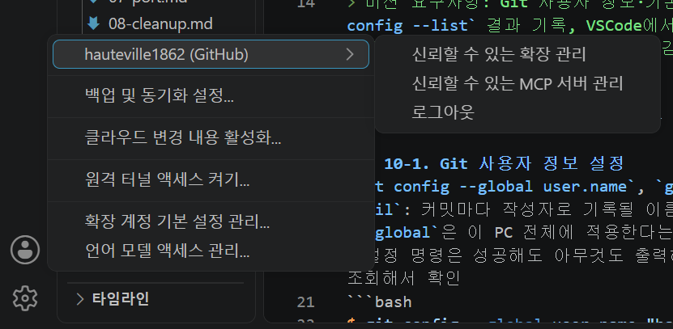

# 10 Git 사용자 정보·기본 브랜치 설정 및 GitHub/VSCode 연동

## 명령어 요약

| 명령어 | 설명 |
| --- | --- |
| `git config --global user.name "이름"` | 커밋 작성자 이름을 전역 설정 |
| `git config --global user.email "이메일"` | 커밋 작성자 이메일을 전역 설정 |
| `git config --global init.defaultBranch main` | 새로 생성하는 저장소의 기본 브랜치명을 main으로 설정 |
| `git config --list` | 현재 적용된 전체 Git 설정 값 확인 |
| `git remote -v` | 로컬 저장소에 연결된 원격 저장소(GitHub) 주소 확인 |
| `git push -u origin main` | 로컬 커밋을 GitHub 원격 저장소로 업로드하고 추적 브랜치 연결 |

> 미션 요구사항: Git 사용자 정보·기본 브랜치 설정 완료 후 `git config --list` 결과 기록, VSCode에서 GitHub 로그인 및 저장소 연동 완료 증거 첨부. 토큰/비밀번호 등 민감 정보는 캡처·로그에 노출되지 않도록 마스킹.

## Part 1. Git 사용자 정보 및 기본 브랜치 설정

### 10-1. Git 사용자 정보 설정
`git config --global user.name`, `git config --global user.email`: 커밋마다 작성자로 기록될 이름/이메일을 설정하는 명령어. `--global`은 이 PC 전체에 적용한다는 뜻
- 설정 명령은 성공해도 아무것도 출력하지 않으므로, 값을 다시 조회해서 확인
```bash
$ git config --global user.name "hauteville1862"
$ git config --global user.email "161007232+hauteville1862@users.noreply.github.com"
$ git config --global user.name
hauteville1862
$ git config --global user.email
161007232+hauteville1862@users.noreply.github.com
```
> 이메일은 GitHub이 제공하는 `noreply` 주소를 사용. 실제 개인 이메일이 커밋 기록에 영구히 남아 공개되는 것을 막기 위함

### 10-2. 기본 브랜치명 설정
`git config --global init.defaultBranch main`: 앞으로 `git init`으로 만드는 저장소의 기본 브랜치명을 `main`으로 정하는 명령어
```bash
$ git config --global init.defaultBranch main
$ git config --global init.defaultBranch
main
```
> 설정 전에는 Git이 기본값으로 `master`를 사용하고 있었음. 현재 GitHub을 포함한 대부분의 환경이 `main`을 기본 브랜치명으로 쓰기 때문에 맞춰서 변경

### 10-3. 설정값 확인
`git config --list`: 적용된 Git 설정 전체를 출력해 위 설정이 실제로 반영됐는지 확인하는 명령어
```bash
$ git config --list
...
core.autocrlf=true
user.name=hauteville1862
user.email=161007232+hauteville1862@users.noreply.github.com
init.defaultbranch=main
core.repositoryformatversion=0
core.filemode=false
core.bare=false
core.logallrefupdates=true
core.symlinks=false
core.ignorecase=true
remote.origin.url=https://github.com/hauteville1862/codyssey-e1.git
remote.origin.fetch=+refs/heads/*:refs/remotes/origin/*
branch.main.remote=origin
branch.main.merge=refs/heads/main
```
확인 포인트
- `user.name` / `user.email` — 10-1에서 설정한 값이 반영됨
- `init.defaultbranch=main` — 10-2 설정이 반영됨
- `remote.origin.url` — 이 저장소가 GitHub 저장소와 연결되어 있음 (Part 2에서 확인)

> 민감정보 점검: 위 출력에 토큰·비밀번호·개인키는 포함되지 않으며, 이메일도 GitHub `noreply` 주소이므로 그대로 기록함

## Part 2. GitHub 로그인 및 VSCode 연동

### 10-4. VSCode에서 GitHub 로그인
VSCode 좌측 하단 계정 아이콘(또는 명령 팔레트 `Sign in to GitHub`)을 통해 GitHub 계정 로그인



- 계정 메뉴에 `hauteville1862 (GitHub)` 계정이 표시됨 — VSCode가 GitHub 계정으로 로그인된 상태
- 하위 메뉴에 `로그아웃` 항목이 있는 것이 현재 로그인되어 있다는 증거

> 캡처 시 주의: 토큰 입력창이나 인증 코드가 보이는 상태로 캡처하지 말 것. 로그인이 **완료된** 화면만 캡처

### 10-5. 로컬 저장소와 GitHub 원격 저장소 연동
`git remote -v`: 로컬 저장소에 연결된 원격 저장소의 이름과 주소를 확인하는 명령어
```bash
$ git remote -v
origin  https://github.com/hauteville1862/codyssey-e1.git (fetch)
origin  https://github.com/hauteville1862/codyssey-e1.git (push)
```
- `origin` — 원격 저장소에 붙인 기본 별칭. 앞으로 긴 URL 대신 이 이름으로 참조
- `(fetch)` / `(push)` — 받아올 때와 보낼 때의 주소. 같은 주소면 정상

### 10-6. 연동 증거 (푸시 성공 확인)
`git push -u origin main`: 로컬 커밋을 원격 저장소에 업로드하는 명령어
```bash
$ git push -u origin main
To https://github.com/hauteville1862/codyssey-e1.git
   176b5e1..017ba7f  main -> main
branch 'main' set up to track 'origin/main'.
```
- `176b5e1..017ba7f` — 원격 저장소가 이전 커밋에서 새 커밋까지 갱신됐다는 의미
- `main -> main` — 로컬 `main` 브랜치의 내용을 원격 `main` 브랜치로 보냈다는 의미
- 마지막 줄은 `-u` 옵션의 결과로, 이후에는 `git push`만 입력해도 `origin main`으로 전송됨

푸시된 결과는 아래 저장소 주소에서 바로 확인 가능
- https://github.com/hauteville1862/codyssey-e1

> 민감한 개인 정보(ID/PW, 토큰 등)가 로그에 포함되지 않도록 주의

## Git과 GitHub의 역할 차이

미션 과제 목표 중 "Git과 GitHub의 역할 차이를 설명할 수 있다"에 대한 정리.

| | Git | GitHub |
| --- | --- | --- |
| 정체 | 내 컴퓨터에서 돌아가는 **버전 관리 프로그램** | Git 저장소를 인터넷에 올려두는 **원격 협업 플랫폼** |
| 위치 | 로컬 (`.git` 디렉토리) | 원격 서버 |
| 하는 일 | 변경 이력 기록(commit), 브랜치 분기/병합, 이전 상태 복원 | 저장소 공유, 코드 리뷰, 이슈 관리 |

- 이 문서 기준으로 **10-1~10-3(Git 설정)은 Git의 영역**, **10-4~10-6(원격 연결·푸시)은 GitHub의 영역**이다.
- GitHub 없이도 `git commit`으로 버전 관리는 가능하다. 다만 이 미션처럼 "저장소 링크만으로 결과물을 확인"하게 하려면 원격 플랫폼이 필요하고, 그 역할을 GitHub이 담당한다.
